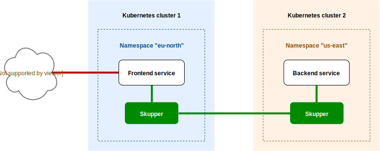
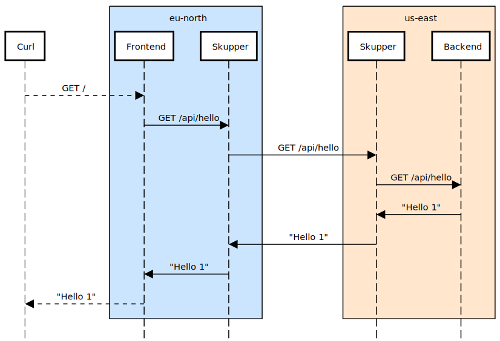

# Skupper Hello World

A minimal HTTP application deployed across Kubernetes clusters using [Skupper](https://skupper.io/)

* [Overview](#overview)
* [Prerequisites](#prerequisites)
* [Step 1: Set up your namespaces](#step-1-set-up-your-namespaces)
* [Step 2: Link your namespaces](#step-2-link-your-namespaces)
* [Step 3: Deploy the backend and frontend services](#step-3-deploy-the-backend-and-frontend-services)
* [Step 4: Expose the backend service on the Skupper network](#step-4-expose-the-backend-service-on-the-skupper-network)
* [Step 5: Test the application](#step-5-test-the-application)
* [What just happened?](#what-just-happened)
* [Cleaning up](#cleaning-up)
* [Next steps](#next-steps)

## Overview

This example is a very simple multi-service HTTP application that can
be deployed across multiple Kubernetes clusters using Skupper.

It contains two services:

* A backend service that exposes an `/api/hello` endpoint.  It returns
  greetings of the form `Hello from <pod-name> (<request-count>)`.

* A frontend service that accepts HTTP requests, calls the backend to
  fetch new greetings, and serves them to the user.

With Skupper, you can place the backend in one cluster and the
frontend in another and maintain connectivity between the two services
without exposing the backend to the public internet.

## Prerequisites

* The `kubectl` command-line tool, version 1.15 or later ([installation guide](https://kubernetes.io/docs/tasks/tools/install-kubectl/))
* The `skupper` command-line tool, the latest version ([installation guide](https://skupper.io/start/index.html#step-1-install-the-skupper-command-line-tool-in-your-environment))
* Two Kubernetes namespaces, from any providers you choose, on any clusters you choose

## Step 1: Set up your namespaces

Since we are dealing with two namespaces, we need to set up isolated
`kubectl` configurations, one for each namespace.  In this example, we
will use distinct kubeconfigs on separate consoles.

Console for namespace `west`:

    export KUBECONFIG=$HOME/.kube/config-west
    <login-command-for-your-provider>
    kubectl create namespace west
    kubectl config set-context --current --namespace west

Console for namespace `east`:

    export KUBECONFIG=$HOME/.kube/config-east
    <login-command-for-your-provider>
    kubectl create namespace east
    kubectl config set-context --current --namespace east

**Note:** If you are using Minikube, you must run `minikube tunnel`
before you install Skupper.  Run it in its own console using the
`west` kubeconfig:

    export KUBECONFIG=$HOME/.kube/config-west
    minikube tunnel

Now that we have our two kubeconfigs, use the `skupper init` command
to install Skupper in each namespace:

Console for namespace `west`:

    skupper init

Console for namespace `east`:

    skupper init --ingress none

Here we are using `--ingress none` in `east` simply to make local
development with Minikube easier.  (It's tricky to run two minikube
tunnels on one host.)  The `--ingress none` option is not required if
your two namespaces are on different hosts or on public clusters.

See [Getting started with Skupper](https://skupper.io/start/) for more
information about setting up namespaces.

Use `skupper status` in each console to check that Skupper is
installed:

    $ skupper status
    Skupper is enabled for namespace '<namespace>'. It is not linked to any other sites.

As you move through the steps below, you can use `skupper status` at
any time to check your progress.

## Step 2: Link your namespaces

To link namespaces, Skupper requires a token representing permission
to create a link.  This token contains a secret (only share it with
those you trust) and the logistical details of making a link.

First, use `skupper token create` in `west` to generate the token:

Namespace `west`:

    skupper token create $HOME/secret.yaml

Then, use `skupper link create` in `east` to use the generated token
to create a link:

Namespace `east`:

    skupper link create $HOME/secret.yaml

If your console sessions are on different machines, you may need to
use `scp` or a similar tool to transfer the token.

## Step 3: Deploy the backend and frontend services

Use `kubectl create deployment` to deploy the services:

Namespace `west`:

    kubectl create deployment hello-world-frontend --image quay.io/skupper/hello-world-frontend

Namespace `east`:

    kubectl create deployment hello-world-backend --image quay.io/skupper/hello-world-backend

## Step 4: Expose the backend service on the Skupper network

We now have linked namespaces, but there is one more step.  Skupper
uses the `skupper expose` command to select a service from one
namespace for exposure on all the linked namespaces.

Use `skupper expose` in `east` to expose the backend:

Namespace `east`:

    skupper expose deployment/hello-world-backend --port 8080

Once the service is marked for exposure, Skupper creates matching
services on all the linked namespaces.  Use `kubectl get services`
in `west` to look for the `hello-world-backend` service.  It may take
a couple attempts before it appears.

Namespace `west`:

    $ kubectl get services
    NAME                   TYPE           CLUSTER-IP       EXTERNAL-IP      PORT(S)          AGE
    hello-world-backend    ClusterIP      10.106.92.175    <none>           8080/TCP         1m31s
    ...

## Step 5: Test the application

At this point, we have established connectivity between the two
namespaces and made the backend in `east` available to the frontend in
`west`.  In order to test everything, we now need external access to
the frontend.

Use `kubectl expose` with `--type LoadBalancer` to open access to the
frontend service:

Namespace `west`:

    kubectl expose deployment/hello-world-frontend --port 8080 --type LoadBalancer

It takes a moment for the external IP to become available.

Look up the external URL and use `curl` to send a request:

Namespace `west`:

    curl $(kubectl get service/hello-world-frontend -o jsonpath='http://{.status.loadBalancer.ingress[0].ip}:8080/')

**Note:** If the embedded `kubectl get` command fails to get the IP,
you can find it manually by running `kubectl get services` and looking
up the external IP of the `hello-world-frontend` service.

Sample output:

    I am the frontend.  The backend says 'Hello from hello-world-backend-6d58c544fc-2gwn6 (1)'.

## What just happened?

This example locates the frontend and backend services in different
namespaces, on different clusters.  Ordinarily, this means that they
have no way to communicate unless they are exposed to the public
internet.

Introducing Skupper into each namespace allows us to create a virtual
application network that can connect services in different clusters.
Any service exposed on the application network is represented as a
local service in all of the linked namespaces.

The backend service is located in `east`, but the frontend service
in `west` can "see" it as if it were local.  When the frontend
sends a request to the backend, Skupper forwards the request to the
namespace where the backend is running and routes the response back to
the frontend.

## Cleaning up

To remove Skupper and the other resources from this exercise, use the
following commands:

Namespace `west`:

    skupper delete
    kubectl delete service/hello-world-frontend
    kubectl delete deployment/hello-world-frontend

Namespace `east`:

    skupper delete
    kubectl delete deployment/hello-world-backend

## Next steps

 - [Try our minimal example for TCP-based communication](https://github.com/skupperproject/skupper-example-tcp-echo)
 - [Find more examples](https://skupper.io/examples/)
