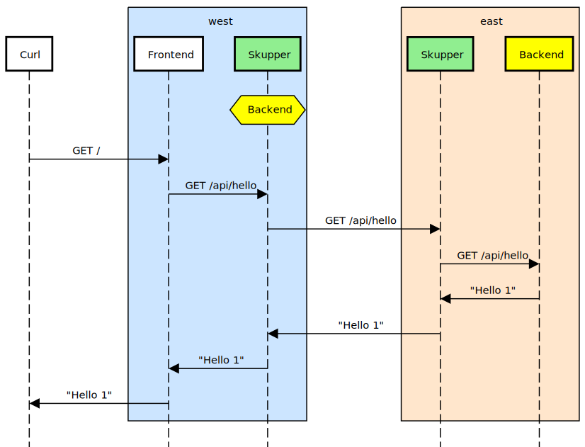

# Skupper Hello World

#### A minimal HTTP application deployed across Kubernetes clusters using Skupper

This example is part of a [suite of examples][examples] showing the
different ways you can use [Skupper][website] to connect services
across cloud providers, data centers, and edge sites.

[website]: https://skupper.io/
[examples]: https://skupper.io/examples/index.html

#### Contents

* [Overview](#overview)
* [Prerequisites](#prerequisites)
* [Step 1: Install the Skupper command-line tool](#step-1-install-the-skupper-command-line-tool)
* [Step 2: Configure separate console sessions](#step-2-configure-separate-console-sessions)
* [Step 3: Access your clusters](#step-3-access-your-clusters)
* [Step 4: Set up your namespaces](#step-4-set-up-your-namespaces)
* [Step 5: Install Skupper in your namespaces](#step-5-install-skupper-in-your-namespaces)
* [Step 6: Check the status of your namespaces](#step-6-check-the-status-of-your-namespaces)
* [Step 7: Link your namespaces](#step-7-link-your-namespaces)
* [Step 8: Fail on demand](#step-8-fail-on-demand)
* [Step 9: Deploy the frontend and backend services](#step-9-deploy-the-frontend-and-backend-services)
* [Step 10: Expose the backend service](#step-10-expose-the-backend-service)
* [Step 11: Expose the frontend service](#step-11-expose-the-frontend-service)
* [Step 12: Test the application](#step-12-test-the-application)
* [Accessing the web console](#accessing-the-web-console)
* [Cleaning up](#cleaning-up)
* [Summary](#summary)
* [Next steps](#next-steps)
* [About this example](#about-this-example)

## Overview

This example is a very simple multi-service HTTP application that can
be deployed across multiple Kubernetes clusters using Skupper.

It contains two services:

* A backend service that exposes an `/api/hello` endpoint.  It
  returns greetings of the form `Hi, <your-name>.  I am <my-name>
  (<pod-name>)`.

* A frontend service that sends greetings to the backend and
  fetches new greetings in response.

With Skupper, you can place the backend in one cluster and the
frontend in another and maintain connectivity between the two
services without exposing the backend to the public internet.

## Prerequisites

Custom prerequisites

## Step 1: Install the Skupper command-line tool

The `skupper` command-line tool is the entrypoint for installing
and configuring Skupper.  You need to install the `skupper`
command only once for each development environment.

On Linux or Mac, you can use the install script (inspect it
[here][install-script]) to download and extract the command:

~~~ shell
curl https://skupper.io/install.sh | sh
~~~

The script installs the command under your home directory.  It
prompts you to add the command to your path if necessary.

For Windows and other installation options, see [Installing
Skupper][install-docs].

[install-script]: https://github.com/skupperproject/skupper-website/blob/main/docs/install.sh
[install-docs]: https://skupper.io/install/index.html

## Step 2: Configure separate console sessions

Skupper is designed for use with multiple namespaces, usually on
different clusters.  The `skupper` command uses your
[kubeconfig][kubeconfig] and current context to select the
namespace where it operates.

[kubeconfig]: https://kubernetes.io/docs/concepts/configuration/organize-cluster-access-kubeconfig/

Your kubeconfig is stored in a file in your home directory.  The
`skupper` and `kubectl` commands use the `KUBECONFIG` environment
variable to locate it.

A single kubeconfig supports only one active context per user.
Since you will be using multiple contexts at once in this
exercise, you need to create distinct kubeconfigs.

Start a console session for each of your namespaces.  Set the
`KUBECONFIG` environment variable to a different path in each
session.

_**Console for west:**_

~~~ shell
export KUBECONFIG=~/.kube/config-west
~~~

_**Console for east:**_

~~~ shell
export KUBECONFIG=~/.kube/config-east
~~~

## Step 3: Access your clusters

The procedure for accessing a Kubernetes cluster varies by
provider. [Find the instructions for your chosen
provider][kube-providers] and use them to authenticate and
configure access for each console session.

[kube-providers]: https://skupper.io/start/kubernetes.html

## Step 4: Set up your namespaces

Use `kubectl create namespace` to create the namespaces you wish
to use (or use existing namespaces).  Use `kubectl config
set-context` to set the current namespace for each session.

_**Console for west:**_

~~~ shell
kubectl create namespace west
kubectl config set-context --current --namespace west
~~~

_**Console for east:**_

~~~ shell
kubectl create namespace east
kubectl config set-context --current --namespace east
~~~

## Step 5: Install Skupper in your namespaces

The `skupper init` command installs the Skupper router and service
controller in the current namespace.  Run the `skupper init` command
in each namespace.

**Note:** If you are using Minikube, [you need to start `minikube
tunnel`][minikube-tunnel] before you install Skupper.

[minikube-tunnel]: https://skupper.io/start/minikube.html#running-minikube-tunnel

_**Console for west:**_

~~~ shell
skupper init --enable-console --enable-flow-collector
~~~

_**Console for east:**_

~~~ shell
skupper init
~~~

_Sample output:_

~~~ console
$ skupper init
Waiting for LoadBalancer IP or hostname...
Skupper is now installed in namespace '<namespace>'.  Use 'skupper status' to get more information.
~~~

## Step 6: Check the status of your namespaces

Use `skupper status` in each console to check that Skupper is
installed.

_**Console for west:**_

~~~ shell
skupper status
~~~

_**Console for east:**_

~~~ shell
skupper status
~~~

_Sample output:_

~~~ console
Skupper is enabled for namespace "<namespace>" in interior mode. It is connected to 1 other site. It has 1 exposed service.
The site console url is: <console-url>
The credentials for internal console-auth mode are held in secret: 'skupper-console-users'
~~~

As you move through the steps below, you can use `skupper status` at
any time to check your progress.

## Step 7: Link your namespaces

Creating a link requires use of two `skupper` commands in
conjunction, `skupper token create` and `skupper link create`.

The `skupper token create` command generates a secret token that
signifies permission to create a link.  The token also carries the
link details.  Then, in a remote namespace, The `skupper link
create` command uses the token to create a link to the namespace
that generated it.

**Note:** The link token is truly a *secret*.  Anyone who has the
token can link to your namespace.  Make sure that only those you
trust have access to it.

First, use `skupper token create` in one namespace to generate the
token.  Then, use `skupper link create` in the other to create a
link.

_**Console for west:**_

~~~ shell
skupper token create ~/secret.token
~~~

_Sample output:_

~~~ console
$ skupper token create ~/secret.token
Token written to ~/secret.token
~~~

_**Console for east:**_

~~~ shell
skupper link create ~/secret.token
~~~

_Sample output:_

~~~ console
$ skupper link create ~/secret.token
Site configured to link to https://10.105.193.154:8081/ed9c37f6-d78a-11ec-a8c7-04421a4c5042 (name=link1)
Check the status of the link using 'skupper link status'.
~~~

If your console sessions are on different machines, you may need
to use `sftp` or a similar tool to transfer the token securely.
By default, tokens expire after a single use or 15 minutes after
creation.

## Step 8: Fail on demand

_**Console for west:**_

~~~ shell
if [ -n "${SKEWER_FAIL}" ]; then expr 1 / 0; fi

~~~

## Step 9: Deploy the frontend and backend services

Use `kubectl create deployment` to deploy the frontend service
in `west` and the backend service in `east`.

_**Console for west:**_

~~~ shell
kubectl create deployment frontend --image quay.io/skupper/hello-world-frontend
~~~

_Sample output:_

~~~ console
$ kubectl create deployment frontend --image quay.io/skupper/hello-world-frontend
deployment.apps/frontend created
~~~

_**Console for east:**_

~~~ shell
kubectl create deployment backend --image quay.io/skupper/hello-world-backend --replicas 3
~~~

_Sample output:_

~~~ console
$ kubectl create deployment backend --image quay.io/skupper/hello-world-backend --replicas 3
deployment.apps/backend created
~~~

## Step 10: Expose the backend service

We now have two namespaces linked to form a Skupper network, but
no services are exposed on it.  Skupper uses the `skupper
expose` command to select a service from one namespace for
exposure on all the linked namespaces.

Use `skupper expose` to expose the backend service to the
frontend service.

_**Console for east:**_

~~~ shell
skupper expose deployment/backend --port 8080
~~~

_Sample output:_

~~~ console
$ skupper expose deployment/backend --port 8080
deployment backend exposed as backend
~~~

## Step 11: Expose the frontend service

We have established connectivity between the two namespaces and
made the backend in `east` available to the frontend in `west`.
Before we can test the application, we need external access to
the frontend.

Use `kubectl expose` with `--type LoadBalancer` to open network
access to the frontend service.

_**Console for west:**_

~~~ shell
kubectl expose deployment/frontend --port 8080 --type LoadBalancer
~~~

_Sample output:_

~~~ console
$ kubectl expose deployment/frontend --port 8080 --type LoadBalancer
service/frontend exposed
~~~

## Step 12: Test the application

Now we're ready to try it out.  Use `kubectl get service/frontend`
to look up the external IP of the frontend service.  Then use
`curl` or a similar tool to request the `/api/health` endpoint at
that address.

**Note:** The `<external-ip>` field in the following commands is a
placeholder.  The actual value is an IP address.

_**Console for west:**_

~~~ shell
kubectl get service/frontend
curl http://<external-ip>:8080/api/health
~~~

_Sample output:_

~~~ console
$ kubectl get service/frontend
NAME       TYPE           CLUSTER-IP      EXTERNAL-IP     PORT(S)          AGE
frontend   LoadBalancer   10.103.232.28   <external-ip>   8080:30407/TCP   15s

$ curl http://<external-ip>:8080/api/health
OK
~~~

If everything is in order, you can now access the web interface by
navigating to `http://<external-ip>:8080/` in your browser.

## Accessing the web console

Skupper includes a web console you can use to view the application
network.  To access it, use `skupper status` to look up the URL of
the web console.  Then use `kubectl get
secret/skupper-console-users` to look up the console admin
password.

**Note:** The `<console-url>` and `<password>` fields in the
following output are placeholders.  The actual values are specific
to your environment.

_**Console for west:**_

~~~ shell
skupper status
kubectl get secret/skupper-console-users -o jsonpath={.data.admin} | base64 -d
~~~

_Sample output:_

~~~ console
$ skupper status
Skupper is enabled for namespace "west" in interior mode. It is connected to 1 other site. It has 1 exposed service.
The site console url is: <console-url>
The credentials for internal console-auth mode are held in secret: 'skupper-console-users'

$ kubectl get secret/skupper-console-users -o jsonpath={.data.admin} | base64 -d
<password>
~~~

Navigate to `<console-url>` in your browser.  When prompted, log
in as user `admin` and enter the password.

## Cleaning up

To remove Skupper and the other resources from this exercise, use
the following commands.

_**Console for west:**_

~~~ shell
skupper delete
kubectl delete service/frontend
kubectl delete deployment/frontend
~~~

_**Console for east:**_

~~~ shell
skupper delete
kubectl delete deployment/backend
~~~

## Summary

This example locates the frontend and backend services in different
namespaces, on different clusters.  Ordinarily, this means that they
have no way to communicate unless they are exposed to the public
internet.

Introducing Skupper into each namespace allows us to create a virtual
application network that can connect services in different clusters.
Any service exposed on the application network is represented as a
local service in all of the linked namespaces.

The backend service is located in `east`, but the frontend service
in `west` can "see" it as if it were local.  When the frontend
sends a request to the backend, Skupper forwards the request to the
namespace where the backend is running and routes the response back to
the frontend.

## Next steps

Custom next steps

## About this example

This example was produced using [Skewer][skewer], a library for
documenting and testing Skupper examples.

[skewer]: https://github.com/skupperproject/skewer

Skewer provides utility functions for generating the README and
running the example steps.  Use the `./plano` command in the project
root to see what is available.

To quickly stand up the example using Minikube, try the `./plano demo`
command.
